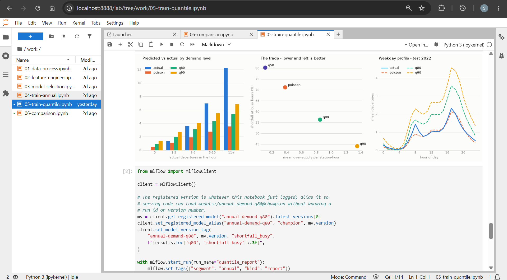
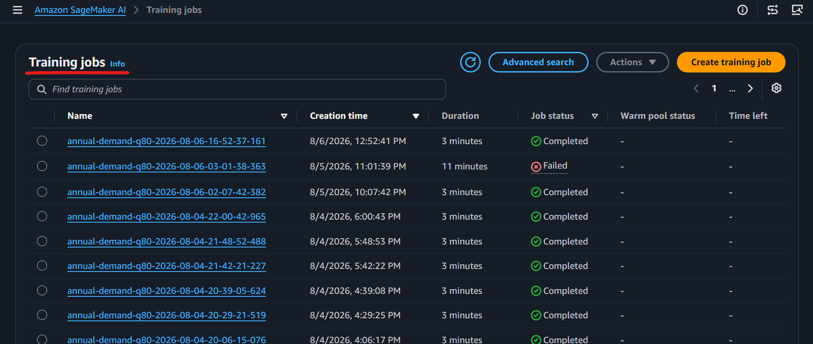
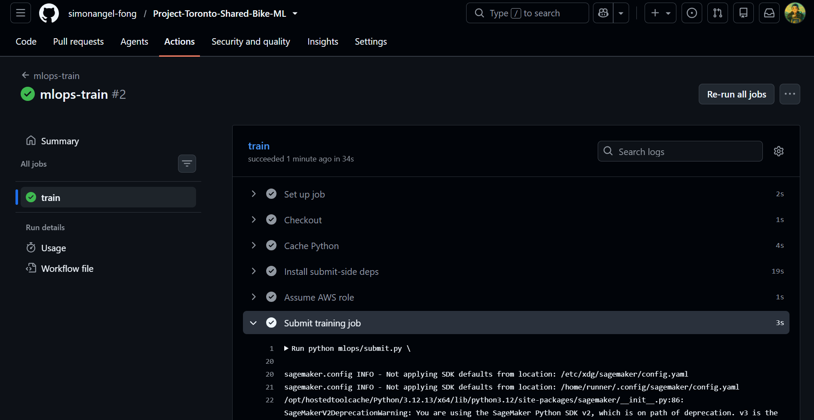
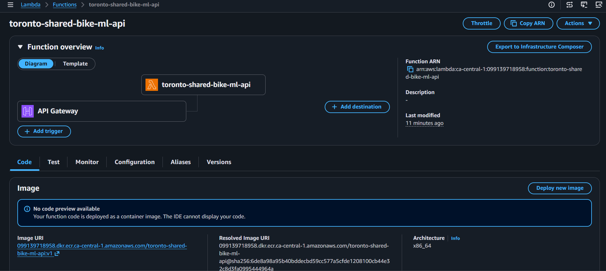
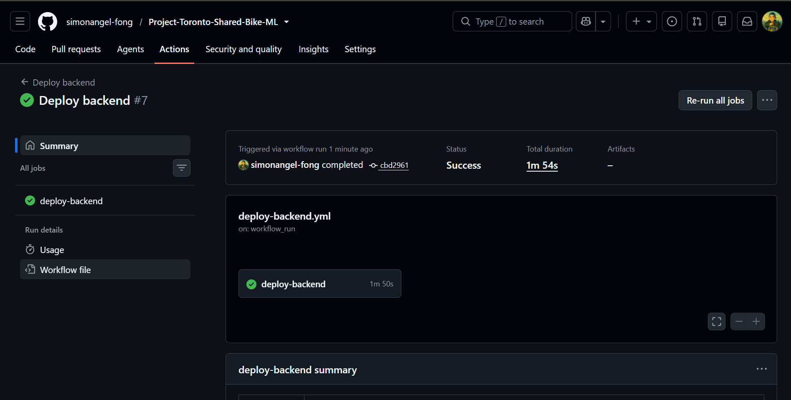
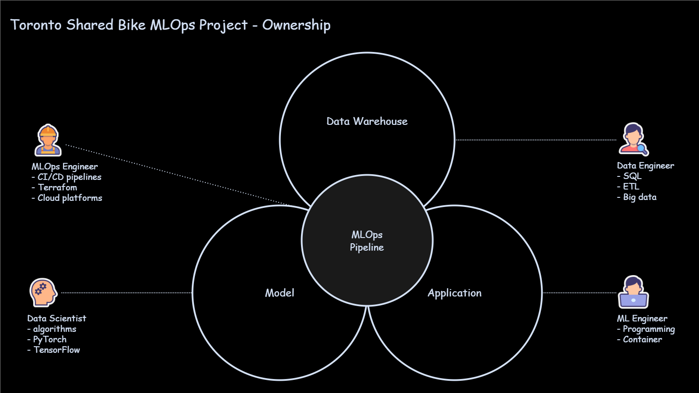

# Toronto Shared Bike MLOps Project

A project demonstrates an end-to-end `MLOps` workflow by training, deploying, and serving a bike-demand forecasting model.

     

- [Toronto Shared Bike MLOps Project](#toronto-shared-bike-mlops-project)
  - [Business Challenge](#business-challenge)
  - [Architecture](#architecture)
  - [Machine Learning](#machine-learning)
    - [Problem Definition](#problem-definition)
    - [Data Collection \& Preparation](#data-collection--preparation)
    - [Model Development \& Training \& Validation](#model-development--training--validation)
    - [Training Pipeline with `Amazon Sagemaker`](#training-pipeline-with-amazon-sagemaker)
  - [Application Deployment](#application-deployment)
  - [Monitoring](#monitoring)
  - [Takeway](#takeway)
  - [Roadmap](#roadmap)
  - [Documentation](#documentation)

---

## Business Challenge

Machine learning turns historical data into insights for faster, data-driven decisions.

> However, **integrating machine learing models reliably into business applications** remains a significant challenge.

This project demonstrates an end-to-end `MLOps` workflow by training, deploying, and serving a bike-demand forecasting model.

---

## Architecture

---

## Machine Learning

### Problem Definition

> Predict hourly bike rentals at the 73 busiest stations for annual members, whose demand is driven primarily by predictable weekday commuting patterns.

**Business impact**:

- **Operations team**: Anticipate demand and rebalance bikes before high-demand stations run out.
- **Annual members**: Improve bike availability and service reliability during regular commutes.

---

### Data Collection & Preparation

This project builds on the [Toronto Shared Bike Data Engineering project](https://trip.arguswatcher.net/), which provides the data warehouse and ETL pipeline.

The trip data is exported from the warehouse and prepared for feature engineering and model training.

---

### Model Development & Training & Validation

Models are developed and evaluated locally using `Jupyter Notebook` and `MLflow`. The workflow covers **feature engineering**, **model selection**, **training**, **validation**, and **experiment tracking**.

- `Jupyter Notebook`: Local tarining

  

- `MLflow`: Runs

  

- `MLflow`: Hyperparameter Training

  

---

### Training Pipeline with `Amazon Sagemaker`

**`Amazone Sagemaker`: Training Jobs**

**`GitHub Actions`: MLOps Pipeline**

---

## Application Deployment

- Serve trained model with AWS:
  - `Lambda`(Docker Image): serverless inference
  - `API Gateway`(HTTP): entry point for service with low cost
  - `S3 bucket`: host frontend files
  - `CloudFront`: cached for performance
  - `Cloudflare`: DNS

- Automate deployment with `GitHub Actions` workflows
  - Triggered when code is updated and/or completed model training jobs
  - Build and push Docker image
  - Update application in AWS.

---

## Monitoring

- Monitor resources with `Cloudwatch`

- Visualize with `Grafana Cloud`

---

## Takeway

A successful ML application requires clear ownership across multiple roles:

- `Data Engineer`: Builds dependable data sources and ETL pipelines.
- `Data Scientist`: Converts business problems into validated models and insights.
- `ML Engineer`: Integrates models into production applications.
- `MLOps Engineer`: Automates training, deployment, monitoring, and integration across the ML lifecycle.

**Key takeway:**

> Clear ownership improves delivery, while MLOps connects each component into a reliable, repeatable production system.

---

## Roadmap

| Stage   | Description                                                                                                  |
| ------- | ------------------------------------------------------------------------------------------------------------ |
| Current | Deliver an end-to-end MLOps MVP covering training, infrastructure, deployment, and inference.                |
| Next    | Shift security left with Trivy and Checkov scanning, dependency checks, and least-privilege IAM policies.    |
| Next    | Integrate AWS Glue to automate the pipeline from new data ingestion through model retraining and deployment. |
| Future  | Monitor data drift, prediction quality, model performance, and service health.                               |
| Future  | Add model approval gates, versioned promotion, rollback, and automated retraining policies.                  |

---

## Documentation

- [Data Engineering - Data warehouse(spark)](./docs/02-de-warehouse.md)
- [Machine Learning Engineering - Jupter Notebook & MLflow](./docs/03-ml.md)
- [MLOps - Amazon Sagemaker & GitHub Actions](./docs/04-mlops.md)
- [ML Application Deployment](./docs/05-mlapp.md)
