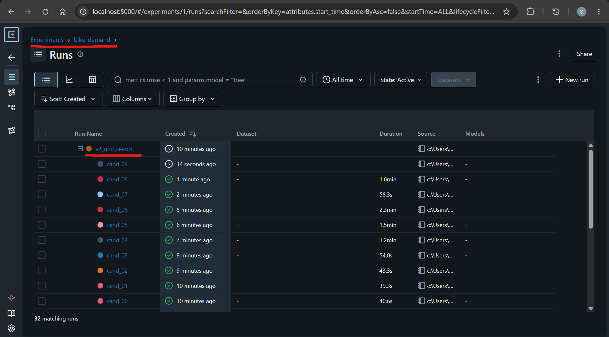
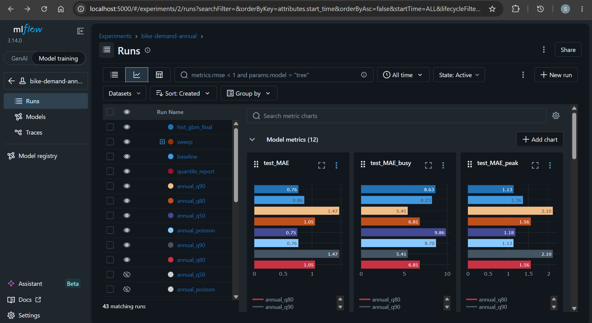
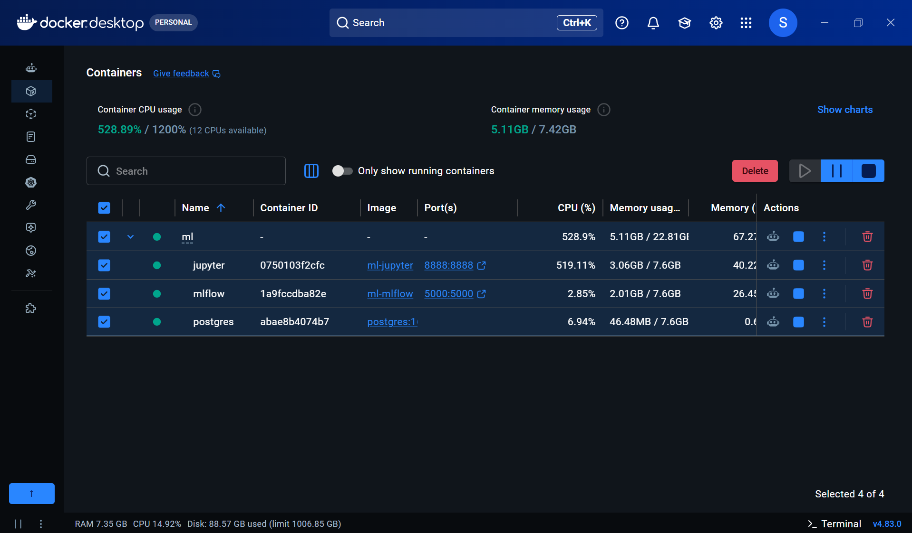

# Toronto Shared Bike MLOps Project - Machine Learning

[Back](../README.md)

- [Toronto Shared Bike MLOps Project - Machine Learning](#toronto-shared-bike-mlops-project---machine-learning)
  - [Business problem](#business-problem)
  - [ML Application](#ml-application)
  - [Phases](#phases)
  - [MLflow](#mlflow)
  - [Development](#development)
    - [Spin up](#spin-up)
    - [Run a notebook](#run-a-notebook)
    - [Upload the selected model to S3](#upload-the-selected-model-to-s3)
    - [Clean up](#clean-up)

---

## Business problem

Predict how many bikes will be rented from each **station** each **hour**, so the
operations team can move bikes to the right places before stations run out.

---

## ML Application

Users: operations team.

- input: month, date, hour, station
- output: departures predicted for that station-hour

Scope is **annual members** on the **73 busiest stations**, 2019-2022. Annual
riders commute on a predictable weekday pattern (peaks at 8 and 17); casual
riders ride afternoons and weekends. Averaging the two loses both shapes. 2023 is
excluded - annual trips collapse to 6.4% of the total, which is a source data
problem, not a change in behaviour.

---

## Phases

| #   | Phase               | Notebook            | Output                      |
| --- | ------------------- | ------------------- | --------------------------- |
| 0   | Environment         | -                   | jupyter + mlflow + postgres |
| 1   | Data processing     | `01`, `04` step 1   | `data/cleaned/annual/`      |
| 2   | Feature engineering | `02`, `04` step 2   | `data/featured/annual/`     |
| 3   | Model selection     | `03`, `04` step 3   | feature set + algorithm     |
| 4   | Split               | `04` step 4         | `data/split/annual/`        |
| 5   | Train Poisson       | `04` steps 5-7      | `annual-demand-poisson`     |
| 6   | Train quantile      | `05-train-quantile` | `annual-demand-q80`         |
| 7   | Compare and decide  | `06-comparison`     | champion alias              |
| 8   | Upload              | -                   | model bundle on S3          |

**Result.** Both models beat the station-hour-weekday baseline, but they answer
different questions. The Poisson model predicts _average_ demand, so it is short
on every busy hour. The q80 model predicts the 80th percentile - a stocking
level - and halves unmet demand at roughly twice the over-supply.

| Model             | MAE  | unmet demand | over-supply |
| ----------------- | ---- | ------------ | ----------- |
| baseline          | 0.86 | 44%          | 59%         |
| poisson           | 0.76 | 45%          | 46%         |
| **q80** (shipped) | 1.05 | **23%**      | 103%        |

MAE is worse for q80 by design: it is deliberately biased upward, and MAE
rewards the middle of the distribution. Neither model predicts a spike - that
needs weather, which is not available here.

---

## MLflow

An open-source platform for tracking ML experiments and managing trained models.

Common uses:

- **Tracking** - record parameters, metrics and artifacts per run, so results are
  comparable rather than remembered
- **Model registry** - name and version models, and alias one as the deployment
  candidate
- **Serving** - load a registered model by name, without knowing which run made it

Used in this project for:

- one experiment, `bike-demand-annual`, holding the baseline, the hyperparameter
  sweep, and both final models
- dataset digests on each run, so "trained on the same rows" is checkable
- a signature on each model, so a serving process can reject a malformed request
- `annual-demand-q80` aliased `@champion`, loadable in one line:

**Hyperparameter Training**



**MLflow Runs**



Use of trained model:

```python
model = mlflow.sklearn.load_model("models:/annual-demand-q80@champion")
```

---

## Development

### Spin up

```sh
docker compose -f ml/docker-compose.yaml up -d --build

docker compose -f ml/docker-compose.yaml ps
# NAME          IMAGE                STATUS                    PORTS
# ml-jupyter    ml-jupyter           Up 16 seconds (healthy)   0.0.0.0:8888->8888/tcp
# ml-mlflow     ml-mlflow            Up 34 seconds (healthy)   0.0.0.0:5000->5000/tcp
# ml-postgres   postgres:16-alpine   Up 3 minutes (healthy)    5432/tcp
```



Jupyter on <http://localhost:8888>, MLflow on <http://localhost:5000>.

---

### Run a notebook

Notebooks run in order; `06-comparison` loads models from the registry, so `04`
and `05` must run first.

```sh
docker compose -f ml/docker-compose.yaml exec jupyter \
  jupyter nbconvert --to notebook --execute --inplace \
  /home/jovyan/work/04-train-annual.ipynb
```

---

### Upload the selected model to S3

Resolve the champion alias to its artifact directory, then copy it - the bundle
holds the model plus the signature and pinned requirements a serving process
needs.

```sh
docker compose -f ml/docker-compose.yaml exec jupyter python -c "
import os, mlflow
mlflow.set_tracking_uri(os.environ['MLFLOW_TRACKING_URI'])
v = mlflow.MlflowClient().get_model_version_by_alias('annual-demand-q80', 'champion')
print(v.source.split('/')[-1])
"
# m-a518bbcd0673404b987fbd741f174d13

aws s3 cp ml/artifacts/2/models/m-a518bbcd0673404b987fbd741f174d13 s3://toronto-shared-bike-ml-ud3m7h/trains/local/annual-demand-q80/v2/ --recursive
```

| File                                  | Purpose                             |
| ------------------------------------- | ----------------------------------- |
| `model.skops`                         | the fitted pipeline                 |
| `MLmodel`                             | flavour and input/output signature  |
| `requirements.txt`, `python_env.yaml` | pinned versions for the serving env |
| `input_example.json`                  | a valid request, for smoke-testing  |

> The prediction is a **stocking target**, not expected demand: q80 means
> "stock to this level and ~80% of hours are covered".

---

### Clean up

```sh
docker compose -f ml/docker-compose.yaml down -v
```
